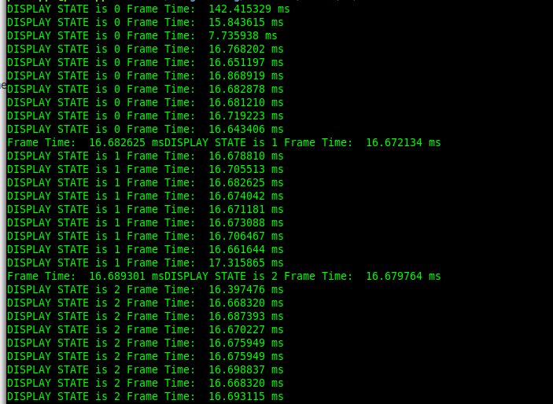

# RenderGU
Rendering ground up (GU) using modern OpenGL

## Current Engine Features
### Display state scene switching

#### Scene Data Examples
```
struct MenuScreenPrototypeData
{
    unsigned int VAO = 0;
    unsigned int shaderProgram = 0;
    unsigned int texture = 0;
    bool button1 = false;
    bool button2 = false;
};

struct Scene1Data
{
    unsigned int VAO = 0;
    unsigned int shaderProgram = 0;
    unsigned int texture = 0;
};

```
#### SceneData Interface
```
struct SceneData
{
    MenuScreenPrototypeData menuScreenPrototypeData;
    Scene1Data scene1Data;
}sceneData;

```
#### Display State
```
enum E_DISPLAY_STATE
{
    MENU_SCREEN_PROTOTYPE,
    SCENE_1,
    //... etc,
}DISPLAY_STATE;

```
#### Main Display Function
```
void display(SceneData* sceneData)
{
    switch(DISPLAY_STATE)
    {
        case MENU_SCREEN_PROTOTYPE:
            display2DMenuPrototype(&sceneData->menuScreenPrototypeData.VAO,
                    &sceneData->menuScreenPrototypeData.shaderProgram,
                    &sceneData->menuScreenPrototypeData.texture,
                    sceneData->menuScreenPrototypeData.button1,
                    sceneData->menuScreenPrototypeData.button2);
            break;
        case SCENE_1:
            displayScene1(&sceneData->scene1Data.VAO,
                    &sceneData->scene1Data.shaderProgram,
                    &sceneData->scene1Data.texture);
            break;
 
		// etc...
        default:
            break;
    }
}

```

#### Call Site (Render Loop)
```
if (DISPLAY_STATE == MENU_SCREEN_PROTOTYPE)
{
	// Example - this will later set shader uniform when rendering
	// to attachments of currently bound framebuffer.
	sceneData.menuScreenPrototypeData.button2 = true; 
}

// Render to attachments of currently bound framebuffer
display(&sceneData)
```
### One-time Intra-Frame Scene Set Up

If there is no VAO do the following for each scene display, once only, inside a frame:

- Create model vertex data -i.e the model
- Write your shaders
- Make the shader program
- Specify the vertices


### Shader Compilation and Linking Utility Functions
#### Function Interfaces
```
unsigned int compileVertexShader(const char* vertexShaderSource);

unsigned int compileFragmentShader(const char* fragmentShaderSource);

unsigned int compileComputeShader(const char* computeShaderSource);

unsigned int linkShaders(
        unsigned int vertexShader,
        unsigned int fragmentShader);

unsigned int linkShaders(unsigned int computeShader);

```
#### Function Call Site
```
*shaderProgram = linkShaders(compileVertexShader(vs), compileFragmentShader(fs));
```

### Real-time Console Performance Data


### Keyboard Input with Rising/Falling Edge Handling
### 3D Camera System (Pitch, Roll, Yaw) and Strafe

## Rendering Showcase
### Lighting

Phong Reflection:

$$Ambient + Diffuse + Specular$$

Phong Exponent, $p$: 

$$\boldsymbol{viewDir}$$ and $$\boldsymbol{reflectionDir}$$ are unit vectors.

$$(max (\boldsymbol{viewDir} \cdot \boldsymbol{reflectionDir}, 0 ))^{p}$$

$\theta\$ is the angle between the above vectors. As $\cos \theta \in\ [0,1], p$ has the effect of simulating specular reflection more accurately (in the fragment shader, the specular reflection factor multiplies the light source).

|Ambient | Diffuse | Specular | $p$ | |
|--------|--------|---------|--|:--:|
| yes| yes|yes|32 ||
| no| yes|yes|32 |  |
| no| no|yes|32 ||
| yes| yes|yes|16 ||
| yes| yes|yes|64 ||


### Post-process Effects
Post-processing implemented by executing two render passes - the first one is an off screen render pass that renders the screen to a texture. This is achieved by creating a framebuffer and binding to that (using renderbuffers for when we don't need to sample depth and stencil buffers):
```
 glClear(GL_COLOR_BUFFER_BIT | GL_DEPTH_BUFFER_BIT | GL_STENCIL_BUFFER_BIT);
		glBindFramebuffer(GL_FRAMEBUFFER, fbo);
		glFramebufferTexture2D(GL_FRAMEBUFFER, GL_COLOR_ATTACHMENT0, GL_TEXTURE_2D, textureTarget, 0);

		// Create renderbuffer for attaching depth to currently bound framebuffer
		glBindRenderbuffer(GL_RENDERBUFFER, rbo);
		glRenderbufferStorage(GL_RENDERBUFFER, GL_DEPTH24_STENCIL8, 800, 600);
		assert(glGetError() == 0);
		glFramebufferRenderbuffer(GL_FRAMEBUFFER, GL_DEPTH_STENCIL_ATTACHMENT, GL_RENDERBUFFER, rbo);
		CheckFramebufferStatus();
```
There is:

- Inversion
- Greyscale (simple average)
- Greyscale (weighted average, eye)
- A scrolling effect
- Multiple Kernel effects: sharpen, blur, edge detection.
- Rear View Mirror


## Resources
- [LearnOpenGL](https://learnopengl.com/)
- Fundamentals Of Computer Graphics 4th Edition (Marschner, S. and Shirley, P., 2018. Fundamentals of computer graphics. CRC Press.)
- Real Time Rendering 4th Edition (Akenine-Moller, T., Haines, E. and Hoffman,  N., 2019. Real-time rendering. AK Peters/crc Press.)
- [Computer Graphcis with Modern OpenGL](https://www.udemy.com/course/graphics- with-modern-opengl/)


